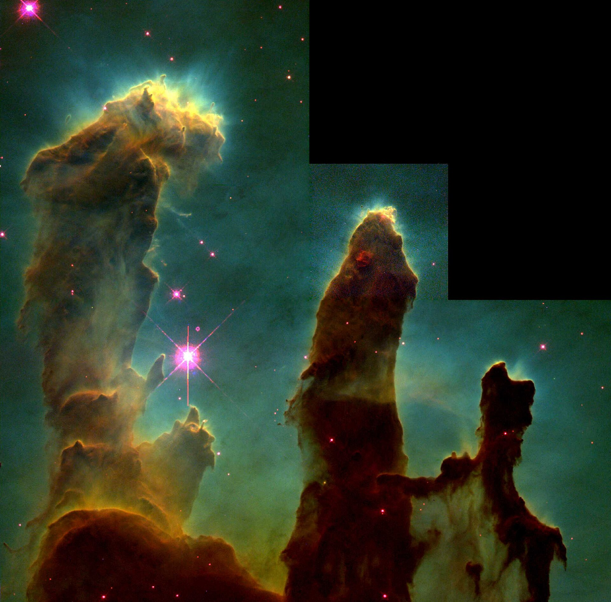

# Color Wheel Visualization Tool

A Python tool for creating color wheel visualizations from images. Maps colors to their positions on a traditional color wheel where opacity represents how frequently each color appears.

## Overview

This tool analyzes images and creates color wheel visualizations where:
- Colors are mapped to their natural position on a traditional color wheel
- Opacity represents frequency - more common colors appear more opaque
- Supports multiple output formats including histograms and spectrums
- Includes performance optimizations for large images

## Examples

### Van Gogh's Starry Night
| Original | Color Wheel |
|----------|-------------|
|  |  |

### Windows Bliss Wallpaper
| Original | Color Wheel |
|----------|-------------|
|  |  |

### Hubble's Pillars of Creation
| Original | Color Wheel |
|----------|-------------|
|  |  |

## Quick Start

1. Install dependencies:
   ```bash
   pip install -e .
   ```

2. Process a single image:
   ```bash
   python color_wheel.py my_image.jpg my_colorwheel.png
   ```

3. Process a folder of images:
   ```bash
   python color_wheel.py /path/to/images --format jpg
   ```

4. View your results - color wheels are saved with `_color_wheel` appended to the original filename.

## Features

### Core Functionality
- Color wheel generation - maps image colors to traditional color wheel positions
- Multiple visualizations - histograms, spectrums, and circular color plots  
- Flexible image support - works with common image formats (JPG, PNG, BMP, etc.)
- Customizable parameters - adjustable quantization, sampling, and output options

### Performance Options
- GPU acceleration - CUDA support via CuPy for faster processing
- JIT compilation - Numba acceleration for CPU-intensive operations
- Parallel processing - multi-core processing for large images
- Template caching - caches wheel templates for faster repeated processing
- Memory mapping - efficient memory usage for large datasets

### Advanced Features
- Nearest neighbor matching - intelligent color mapping with KDTree optimization
- Color space conversions - RGB, HSV, and other color space support  
- Folder processing - process entire directories of images automatically
- Batch operations - multi-image processing with progress tracking
- Command line interface - full CLI support with comprehensive options
- Comprehensive testing - 600+ tests ensuring reliability

## Installation

```bash
# Clone the repository
git clone <repository-url>
cd "Color Wheel"

# Create and activate virtual environment
python -m venv .venv
# Windows
.venv\Scripts\activate
# macOS/Linux  
source .venv/bin/activate

# Install the package
pip install -e .

# Optional: Install performance enhancements
pip install cupy-cuda12x  # For CUDA 12.x
pip install numba scikit-learn  # For additional optimizations
```

## Usage

```bash
# Single image processing
python color_wheel.py input_image.jpg output_wheel.png

# Different output formats
python color_wheel.py input_image.jpg output_wheel.jpg --format jpg
python color_wheel.py input_image.jpg output_wheel.png --format png

# Process entire folder of images
python color_wheel.py /path/to/image/folder --format jpg
python color_wheel.py /path/to/image/folder --format png

# Add extra visualizations
python color_wheel.py input_image.jpg output_wheel.png --show-reference --histogram --color-spectrum

# Performance mode
python color_wheel.py input_image.jpg output_wheel.png --gpu --parallel --force-kdtree
```

### Folder Processing

```bash
# Process all images in a folder, save as JPG color wheels
python color_wheel.py "C:\Users\Photos\Vacation" --format jpg

# Process with custom settings
python color_wheel.py "./my_images" --format png --size 600 --quantize 4 --show-reference

# Batch processing with performance options
python color_wheel.py "./large_image_set" --format jpg --gpu --parallel --sample-factor 2
```

## Command Line Options

```bash
python color_wheel.py INPUT [OUTPUT] [OPTIONS]

Required Arguments:
  INPUT                 Input image file path OR folder path containing images

Optional Arguments:
  OUTPUT                Output file path (required for single images, ignored for folders)

Format Options:
  --format {png,jpg}    Output format: png (supports transparency) or jpg (black background)
                        Required when processing folders, default: png

Processing Options:
  --size SIZE           Size of the color wheel (default: 800)
  --sample-factor N     Factor to downsample input for faster processing (default: 1)
  --quantize N          Color quantization level: 1=precise, higher=more grouping (default: 2)
  --color-space SPACE   Color space: sRGB, Adobe RGB, ProPhoto RGB (default: sRGB)

Performance Options:
  --gpu                 Force GPU acceleration (requires CuPy)
  --no-gpu              Disable GPU acceleration
  --parallel            Force parallel processing
  --no-parallel         Disable parallel processing  
  --force-kdtree        Force KDTree for nearest neighbor (requires scikit-learn)
  --no-kdtree           Disable KDTree, use vectorized fallback

Visualization Options:
  --show-reference      Also save a reference color wheel for comparison
  --histogram           Generate opacity histogram
  --color-spectrum      Generate color spectrum histogram
  --circular-spectrum   Generate circular color spectrum
```

### Folder Processing Notes

When processing folders:
- Format is required (`--format jpg` or `--format png`)
- Output path is ignored - wheels are saved next to original images
- Automatic naming - adds `_color_wheel` to original filename
- Finds all supported image formats (JPG, JPEG, PNG, BMP, TIFF, TIF, WEBP, GIF)

## Visualization Types

### 1. Color Wheel
The main visualization showing colors mapped to their positions on a traditional color wheel with opacity indicating frequency.

### 2. Opacity Histogram  
A histogram showing color distribution with opacity-weighted bars.

### 3. Color Spectrum Histogram
Traditional histogram with colors represented by their actual RGB values.

### 4. Circular Color Spectrum
A circular arrangement showing color progression around the wheel perimeter.

## 🏗️ Architecture

### Core Components

- `create_color_wheel()` - Main color wheel generation function
- `load_and_analyze_image()` - Image loading and color analysis
- `find_nearest_wheel_colors()` - Color mapping to wheel positions
- Template System - Efficient wheel template generation and caching
- Visualization Functions - Multiple output format generators

### Optimization Systems

- GPU Processing - CuPy-based GPU acceleration for color operations
- JIT Compilation - Numba-accelerated hot paths for CPU processing
- Parallel Computing - Multi-process handling for large images
- Smart Caching - Template and computation result caching
- Memory Mapping - Efficient handling of large datasets

### Performance Characteristics

| Image Size | CPU Time | GPU Time | Memory Usage |
|------------|----------|----------|--------------|
| 1MP        | ~2s      | ~0.3s    | ~50MB       |
| 5MP        | ~8s      | ~0.8s    | ~200MB      |
| 10MP       | ~20s     | ~1.5s    | ~400MB      |
| 50MP       | ~120s    | ~6s      | ~2GB        |

## Testing

The project includes a comprehensive test suite with 600+ tests covering all functionality:

```bash
# Run all tests
pytest

# Run with coverage report  
pytest --cov=color_wheel --cov-report=html

# Run only fast tests
pytest -m "not slow"

# Run performance tests
pytest tests/test_performance_edge_cases.py

# Use the custom test runner
python run_tests.py --coverage
```

### Test Categories
- **Core Functions** - Basic utility and color processing functions
- **Image Analysis** - Image loading and color extraction  
- **Template System** - Wheel template generation and caching
- **Nearest Neighbor** - Color matching algorithms
- **Visualizations** - All output format generation
- **CLI Interface** - Command-line argument parsing and integration
- **Performance** - Large image handling and optimization paths
- **Edge Cases** - Error conditions and boundary cases

## 🔧 Configuration

### Environment Variables
```bash
# GPU settings
export CUDA_VISIBLE_DEVICES=0  # Select GPU device
export CUPY_CACHE_DIR=/path/to/cache  # CuPy cache location

# Performance tuning
export NUMBA_CACHE_DIR=/path/to/cache  # Numba cache location  
export OMP_NUM_THREADS=4  # OpenMP thread count
export OPENBLAS_NUM_THREADS=4  # BLAS thread count
```

### Template Caching
Templates are automatically cached in:
- Windows: `%APPDATA%/color_wheel/templates/`
- macOS: `~/Library/Caches/color_wheel/templates/`
- Linux: `~/.cache/color_wheel/templates/`

## Performance Optimization

### For Small Images (< 1MP)
```bash
python color_wheel.py image.jpg --quantize 8
```

### For Medium Images (1-10MP)  
```bash
python color_wheel.py image.jpg --parallel --quantize 16 --sample-factor 2
```

### For Large Images (> 10MP)
```bash
python color_wheel.py image.jpg --gpu --parallel --force-kdtree --quantize 32 --sample-factor 4
```

### Batch Processing
```bash
python color_wheel.py *.jpg --parallel --output-dir results/
```

## 🔍 Troubleshooting

### Common Issues

**ModuleNotFoundError: No module named 'color_wheel'**
```bash
# Install in development mode
pip install -e .
```

**CUDA/GPU Errors**
```bash
# Check GPU availability
python -c "import cupy; print('GPU available')"

# Fallback to CPU
python color_wheel.py image.jpg  # (without --use-gpu)
```

**Memory Issues**
```bash
# Reduce memory usage
python color_wheel.py image.jpg --quantization 8 --sample 4 --no-mmap
```

**Slow Performance**
```bash
# Enable all optimizations
python color_wheel.py image.jpg --use-gpu --use-numba --use-kdtree --parallel
```

### Performance Tips

1. **Use GPU acceleration** for large images when available
2. Enable parallel processing for multi-core systems  
3. Increase sampling factor for very large images to reduce processing time
4. Use appropriate quantization - higher values = faster processing, lower quality
5. Keep templates cached - don't clear cache directory for better performance

## Contributing

1. Fork the repository
2. Create a feature branch (`git checkout -b feature/amazing-feature`)
3. Make your changes
4. Add tests for new functionality
5. Run the test suite (`python run_tests.py`)
6. Commit your changes (`git commit -m 'Add amazing feature'`)
7. Push to the branch (`git push origin feature/amazing-feature`)
8. Open a Pull Request

## Dependencies

### Required
- Python 3.8+
- NumPy - Numerical computing
- OpenCV - Image processing  
- Matplotlib - Visualization and plotting
- Pillow - Additional image format support

### Optional (for enhanced performance)
- CuPy - GPU acceleration
- Numba - JIT compilation
- scikit-learn - KDTree nearest neighbor optimization
- psutil - Memory monitoring

### Development
- pytest - Testing framework
- pytest-cov - Coverage reporting
- pytest-xdist - Parallel test execution

## License

This project is licensed under the MIT License - see the LICENSE file for details.

## Acknowledgments

- Claude Sonnet 4
- Github Copilot
- Performance optimization techniques from the scientific Python ecosystem

---

**Made by Noam Elisha**